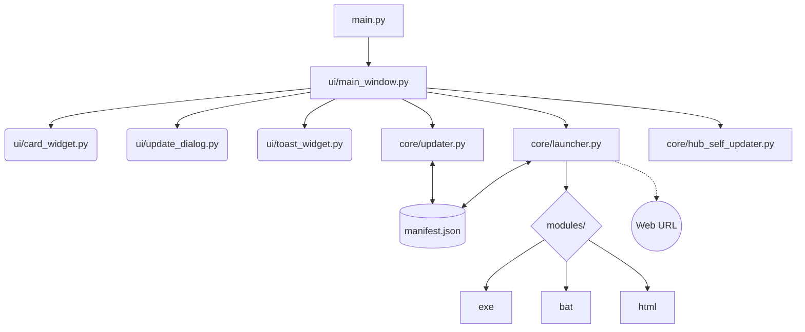
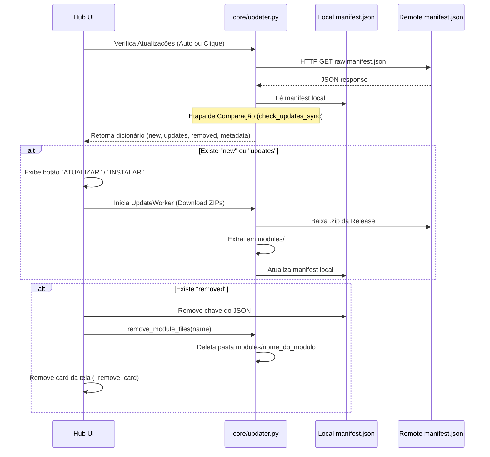
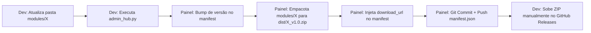

# Arquitetura do Hub de Engenharia

O Hub de Engenharia é projetado para operar como um sistema distribuído *Master-Node*, onde o repositório no GitHub atua como fonte da verdade (Master) e cada instalação do Hub nas máquinas dos usuários (Nodes) se sincroniza ativamente.

## Diagrama de Componentes (Local)

## O Papel do `manifest.json`

O `manifest.json` é a espinha dorsal do Hub. Existem duas instâncias desse arquivo:
1. **Manifest Remoto (GitHub)**: Fica na branch `main`. Dita a regra: *o que está aqui, é o que deve existir na empresa*.
2. **Manifest Local (Máquina do Usuário)**: Fica na raiz do executável. Representa o estado atual do que o usuário já baixou/instalou.

A diferença entre os dois arquivos dita as ações que o Hub deve tomar (Baixar módulo novo, Baixar atualização, ou Deletar módulo).

## Fluxo de Sincronização e Atualização (`updater.py`)

A verificação ocorre de forma assíncrona usando `QThread` para não travar a interface (`CheckUpdatesWorker`).

## Ciclo de Vida do Executável (`hub_self_updater.py`)

O Hub também é capaz de se atualizar. Para contornar a limitação do Windows que impede sobrescrever um `.exe` que está em execução, o fluxo é:

1. Compara `hub_version` do manifest remoto com `HUB_VERSION` em `config.py`.
2. Se remoto for maior, baixa o `.exe` ou `.zip` com o novo executável e salva como `HubEngenharia.exe.new`.
3. Cria um arquivo temporário `update_hub.bat` dinâmico.
4. Executa o `.bat` em background e se encerra (`sys.exit`).
5. O `.bat` roda comandos: dá kill no PID do Hub, espera 2s, renomeia `.new` para o original, executa o novo Hub e deleta a si mesmo.

## Fluxo do Pipeline (Release)

O desenvolvedor não empacota arquivos zip manualmente. O script `scripts/admin_hub.py` em conjunto com `scripts/build_release.py` automatizam isso.

